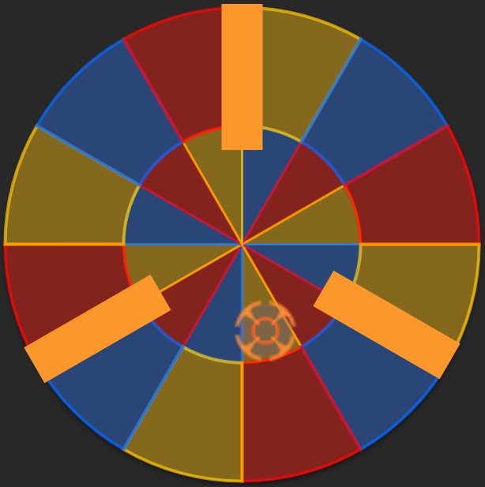
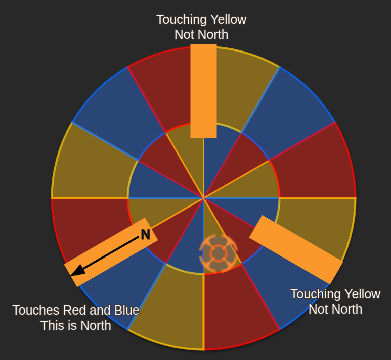
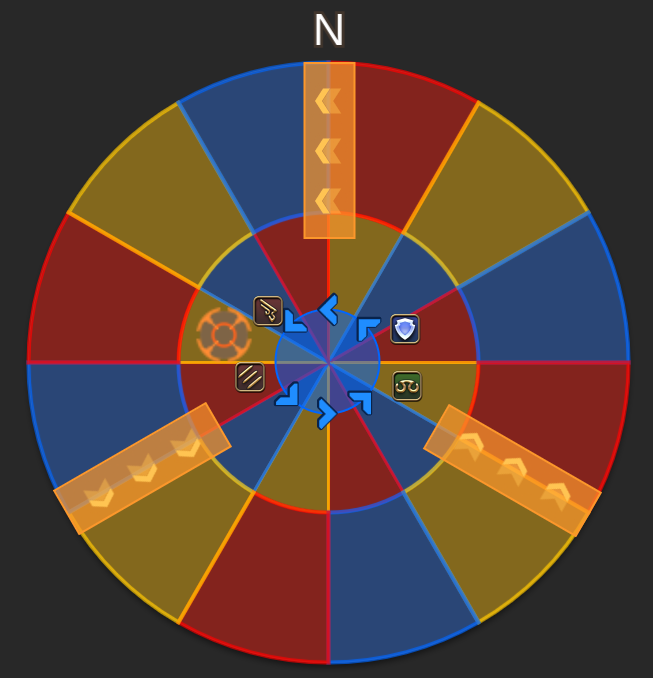
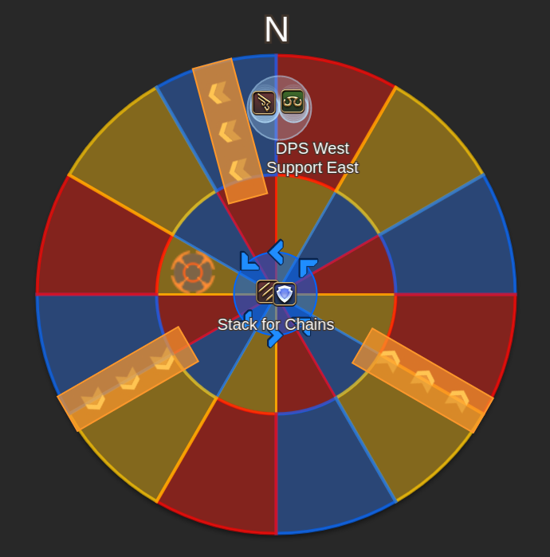
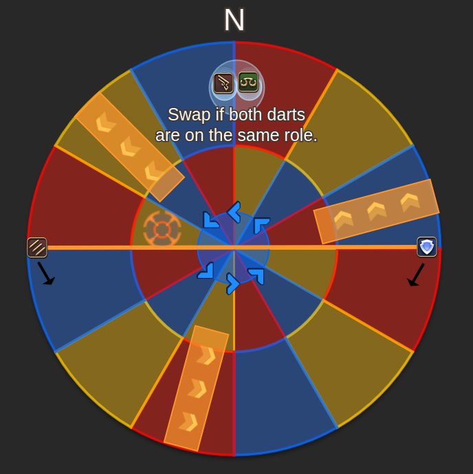
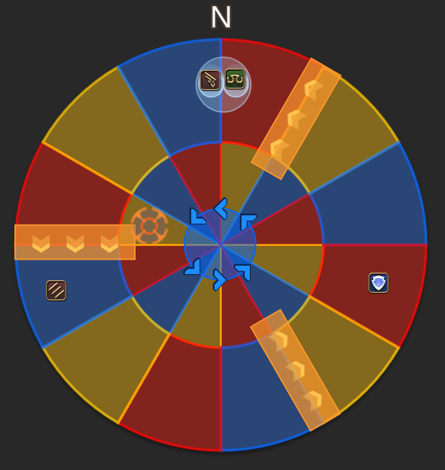

# Statice - Dartboard 2
*This strategy comes from Big Kobe's guide*

## Identify Relative North

| | |
| - | - |
| 3 fire walls will spawn around the arena, splitting it into thirds. Additionally, a single dart (Symbolized with a Target) will drop onto one of the slices. Additionally, there will be a rotation symbol. | 
| The outer edge of each of those fire walls touch two colors - the fire wall that doesn't touch the color that the dart landed on is relative north. In the above example where a dart fell on yellow, we need to identify which of the fire walls is not touching a yellow slice. In that case, the South West wall is relative north. | 

## Positioning

DPS will preposition relative West. Support preposition relative East. A DPS and Support will be tethered together and get defamation. The other two players will need to resolve Enumeration. Two players will also receive dart markers at random - make note of whether these are the same role, or different.

*This arena has been rotated to match the previous examples*

## Step 1

**Enumeration players** Go north as soon as you identify your role. DPS should be on the relative west marker, and support on the relative east.

**Defamation players** Stack mid, and wait for the tethers to go out. This happens at the same time that the defamation markers appear.

*Not Pictured: Dart Debuffs*

## Step 2

**Enumeration players** Solve the dart debuffs - If both of the darts are on players of the same role, then the enumeration players swap sides - DPS takes east side, Support takes west. Othewrise, stay on your role's side.

**Defamation players** As soon as the defamation AOEs are visible, the DPS should head directly west, and the support directly east. After the tether breaks, both players should adjust south.

## Dart Positions
This is where players end up after all the movement. The AOEs will continue for 1 more slice before finishing.

